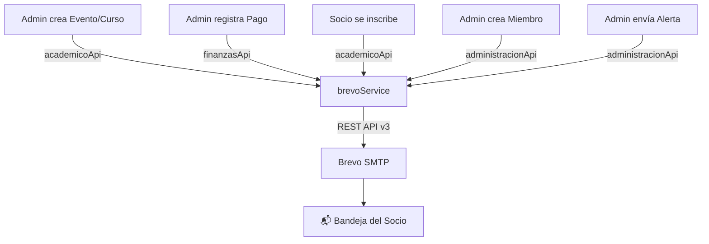

# 📧 Integración Brevo - Servicio de Notificaciones por Email

## Arquitectura



## Archivos Creados/Modificados

| Archivo | Acción | Descripción |
|---------|--------|-------------|
| [brevo.js](file:///d:/Gestion%201-2026/Taller%20de%20Grado/Codigo/control-financiero/src/services/brevo.js) | **Nuevo** | Servicio principal con 7 funciones de email |
| [academico/api](file:///d:/Gestion%201-2026/Taller%20de%20Grado/Codigo/control-financiero/src/features/academico/api/index.js) | Modificado | Notifica en: crear evento, crear actividad, inscripción |
| [finanzas/api](file:///d:/Gestion%201-2026/Taller%20de%20Grado/Codigo/control-financiero/src/features/finanzas/api/index.js) | Modificado | Notifica en: registrar pago |
| [administracion/api](file:///d:/Gestion%201-2026/Taller%20de%20Grado/Codigo/control-financiero/src/features/administracion/api/index.js) | Modificado | Notifica en: crear miembro + función `enviarAlertaEmail` |

## Funciones del Servicio Brevo

| Función | Trigger | Destinatario | Color |
|---------|---------|--------------|-------|
| `notificarPagoRegistrado` | Pago registrado | Socio individual | 🟢 Verde |
| `notificarPagoPendiente` | Manual / programado | Socio individual | 🟡 Amarillo / 🔴 Rojo |
| `notificarNuevoEvento` | Evento creado | Todos los socios activos | 🔵 Azul |
| `notificarNuevoCurso` | Curso creado | Todos los socios activos | 🟢 Esmeralda |
| `notificarInscripcionEvento` | Inscripción a evento | Socio individual | 🟢 Verde |
| `notificarInscripcionCurso` | Inscripción a curso | Socio individual | 🟢 Esmeralda |
| `enviarNotificacionGeneral` | Manual (admin) | Personalizable | Configurable |

## Flujo de Notificaciones Automáticas

### Al crear un Evento/Curso:
1. Se guarda en Supabase → `evento` / `actividad_academica`
2. Se consultan **todos los socios activos** con email
3. Se envía email masivo en **segundo plano** (no bloquea la UI)

### Al inscribirse:
1. Se registra inscripción en `inscripcion`
2. Se consulta datos del socio y del evento/curso
3. Se envía email de **confirmación individual**

### Al registrar un pago:
1. Se guarda en `ingreso`
2. Se consulta datos del socio
3. Se envía email de **confirmación de pago**

### Al crear un nuevo miembro:
1. Se crea en Auth + `miembro`
2. Se envía **email de bienvenida**

> [!IMPORTANT]
> Todos los envíos de email son **fire-and-forget** (no bloquean la operación principal).
> Si el email falla, se registra en `console.error` pero la acción del usuario NO se interrumpe.

## Uso de `enviarAlertaEmail` (Administración)

```javascript
// Enviar a todos los socios activos
await administracionApi.enviarAlertaEmail({
  titulo: 'Recordatorio de pago mensual',
  mensaje: 'Recuerda que la fecha límite de pago es el día 15.',
  tipo: 'warning'
});

// Enviar a un socio específico
await administracionApi.enviarAlertaEmail({
  titulo: 'Tu cuenta ha sido activada',
  mensaje: 'Ya puedes acceder a todos los servicios.',
  miembroId: 'uuid-del-socio',
  tipo: 'success'
});
```

> [!NOTE]
> `enviarAlertaEmail` también guarda la notificación en la tabla `notificacion` de la BD,
> de modo que el socio puede verla tanto en su email como en el portal web.
